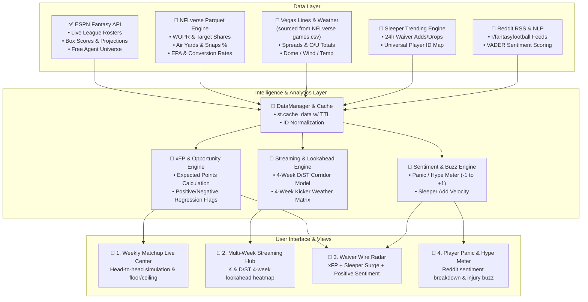
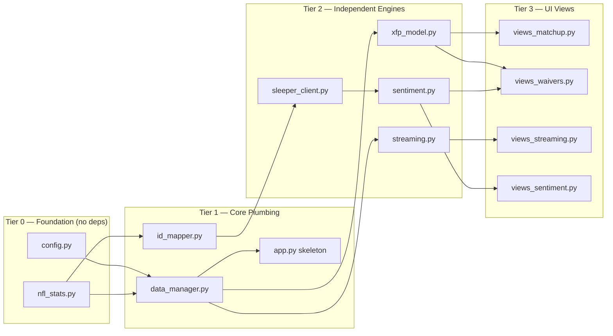

# 🏗️ System Architecture & Data Flow

> **Status Legend:** ✅ = Implemented & tested | 🚧 = Partially built | 🔲 = Not yet started



---

## Build Order & Dependency Graph

Features must be built in this order. Each tier depends on the one above it.



---

## Data Flow Narrative

1. **Config** (`config.py`) loads `.env` and exposes league credentials + the current NFL season year.
2. **ESPN Client** (`espn_client.py` ✅) fetches live roster, free-agent pool, box scores, and scoring rules from the ESPN API.
3. **NFLverse Loader** (`nfl_stats.py` 🔲) downloads season-level Parquet files (player stats, snap counts) and `games.csv` (schedule, Vegas lines, weather) via HTTPS. This is the backbone of all analytics.
4. **ID Mapper** (`id_mapper.py` 🔲) normalizes player identity across ESPN, Sleeper, and NFLverse using the Sleeper `/players/nfl` universe as the canonical mapping table.
5. **DataManager** (`data_manager.py` 🔲) orchestrates all data sources behind `@st.cache_data`, exposes merged DataFrames to engines (e.g., `get_merged_player_pool()` joins ESPN free agents with NFLverse stats and Vegas lines).
6. **Engines** compute derived analytics: xFP (expected fantasy points from volume + efficiency), Streaming (multi-week D/ST and K projections), Sentiment (Reddit NLP + Sleeper trending velocity).
7. **UI Views** consume engine outputs and render Streamlit pages with Plotly charts, heatmaps, and metric cards.

---

## Modular Directory Layout

```
fantasy-companion/
├── app.py                      # 🔲 Main Streamlit entrypoint
├── requirements.txt            # ✅ Project dependencies
├── .env.example                # ✅ Configuration template
├── .gitignore                  # ✅
├── docs/
│   ├── DATA_ARSENAL.md         # ✅ Public API specifications
│   ├── STREAMING_ENGINE.md     # ✅ Multi-week streaming models
│   └── ARCHITECTURE.md         # ✅ System design & data flow (this file)
├── src/
│   ├── __init__.py             # ✅
│   ├── core/
│   │   ├── __init__.py         # ✅
│   │   ├── config.py           # 🔲 Settings & env parser
│   │   ├── data_manager.py     # 🔲 Master data loader & caching
│   │   └── id_mapper.py        # 🔲 Player ID normalization across platforms
│   ├── engines/
│   │   ├── __init__.py         # ✅
│   │   ├── espn_client.py      # ✅ ESPN League API wrapper
│   │   ├── nfl_stats.py        # 🔲 NFLverse parquet loader
│   │   ├── sleeper_client.py   # 🔲 Sleeper trending + player universe
│   │   ├── streaming.py        # 🔲 Kicker & D/ST multi-week projection engine
│   │   ├── sentiment.py        # 🔲 Reddit search RSS & VADER analyzer
│   │   └── xfp_model.py        # 🔲 Expected Fantasy Points & Regression engine
│   └── ui/
│       ├── __init__.py         # ✅
│       ├── components.py       # 🔲 Custom cards, metrics, and styling
│       ├── views_matchup.py    # 🔲 Matchup Live Center view
│       ├── views_streaming.py  # 🔲 K & D/ST Multi-Week Streaming view
│       ├── views_waivers.py    # 🔲 Waiver Wire Radar view
│       └── views_sentiment.py  # 🔲 Player Panic / Hype Meter view
```
